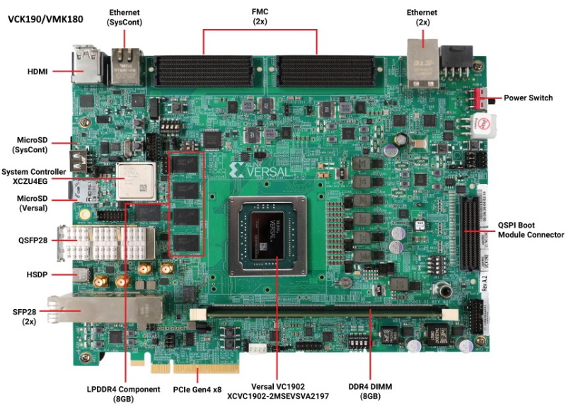
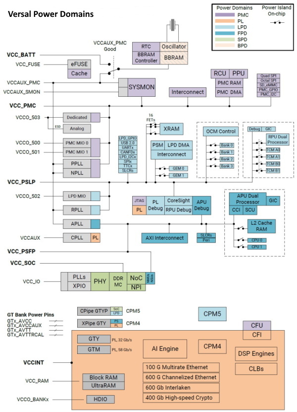
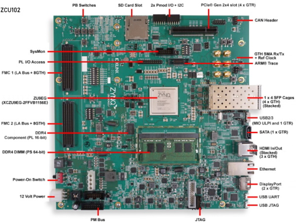

##### Copyright (C) 2022, Advanced Micro Devices, Inc.  All rights reserved.
##### SPDX-License-Identifier: MIT
1. [Power management demo](#1-Power-management-demo)<br>
2. [Build Instructions](#2-build-instructions)<br>
3. [Directory Structure](#3-directory-structure)<br>
4. [Test](#4-test)<br>
5. [Measured power](#5-measured-power)<br>
6. [References](#6-references)<br>

### 1. Power management demo
This repository contains the source code needed to recreate, modify, and extend 
classic SOC boot power demo to demonstrate versal/ZynqMP various power modes. It
demonstrates below power modes on vck190/vmk180/zcu102 boards.
```
 1. APU, RPU, PL load (typical performance mode)<br>
 2. APU and RPU full load, PL is OFF (Performance mode)
 3. APU full load, RPU idle, PL is OFF
 4. APU (APU0 only) full load, RPU idle, PLD is OFF
 5. APU (APU0 low freq 250MHz) full, RPU idle, PL is OFF
 7. APU Linux Idle, RPU idle, PL is OFF (Linux Boot Idle)
 8. APU suspended with FPD ON, RPU idle, PL is OFF
 9. APU suspended with FPD OFF, RPU full load, PL is OFF
10. APU suspended with FPD OFF, RPU idle, PL is OFF
11. APU suspended with FPD OFF, RPU suspended, PL is OFF
```

To build sample designs from source code in this repository, you will need to have the
following tools installed and follow the [build instructions](#2-build-instructions):

- A Linux-based host OS supported by Vitis and PetaLinux with about 100GB free
  disk space
- [Vitis][1] 202x.x
- [PetaLinux][2] 202x.x

[1]: https://www.xilinx.com/support/download/index.html/content/xilinx/en/downloadNav/vitis.html
[2]: https://www.xilinx.com/support/download/index.html/content/xilinx/en/downloadNav/embedded-design-tools.html









### 2. Build Instructions
```
Defaults:
 RELEASE=2022.2
 TARGET=vck190
 PETALINUX_BSP=/proj/petalinux/2022.2/petalinux-v2022.2_daily_latest/bsp/release/xilinx-vck190-v2022.2-final.bsp
 PETALINUX_SETTINGS=/proj/petalinux/2022.2/petalinux-v2022.2_daily_latest/tool/petalinux-v2022.2-final/settings.sh
 VITIS_SETTINGS=/proj/xbuilds/2022.2_daily_latest/installs/lin64/Vitis/2022.2/settings64.sh
 Note: Modify Makefile RELEASE=202x.x to build for a different release.
```
Vitis and PetaLinux tools need to be installed before building any design.
```bash
export PETALINUX_BSP=<PetaLinux BSP path>
export PETALINUX_SETTINGS=<PetaLinux install path>/settings.sh
export VITIS_SETTINGS=<Vitis_install_path>/Vitis/202x.x/settings64.sh
./settings.sh	# Verify environment variable settings in a shell session
```

Use make to build hardware design, petalinux (or ./xmake to use docker), rpu application
and boot image for `TARGET=[vck190|vmk180|zcu102]`.
The final artifacts in build/images<br>
Note: It will take several hours (> 6 hours) to build all components.<br>
      &nbsp;&nbsp;&nbsp;&nbsp;Remove hwflow_xxx, rpu_app, xilinx-xxx for a clean build.
- `make`
    or
- `make TARGET=[vck190|vmk180|zcu102]`
    or
- `make hw_design TARGET=[vck190|vmk180|zcu102]`
- `make petalinux TARGET=[vck190|vmk180|zcu102]`
- `make rpu_app TARGET=[vck190|vmk180|zcu102]`
- `make boot_image TARGET=[vck190|vmk180|zcu102]`

### 3. Directory Structure
```
.pm_demo
├─ apu_app - APU application
│   ├─ power_demo.sh - power demo script
│   └─ power-oob.bb  - power demo binary files bitbake
├─ doc
│   ├─ vck190_board.jpg
│   └─ versal_power_domains.jpg
├─ hw   - Hardware design
│   ├─ ip
│   │   ├─ bufg_ctrl
│   │   │   ├─ component.xml
│   │   │   ├─ src
│   │   │   │   └─ bufg_ctrl.v
│   │   │   ├─ xgui
│   │   │   │    └─ bufg_ctrl_v1_0.tcl
│   │   │   └── component.xml
│   │   └─ power
│   │      ├─ src
│   │      │   ├─ block_ram_daisy_chain.v
│   │      │   ├─ generate_sfir.v
│   │      │   ├─ logic_top.v
│   │      │   ├─ logic.v
│   │      │   ├─ power.v
│   │      │   ├─ vio_bram
│   │      │   │   └── vio_bram.xci
│   │      │   └─ vio_top_logic
│   │      │        └─ vio_top_logic.xci
│   │      ├─ xgui
│   │      │    └─ power_v1_0.tcl
│   │      └─ component.xml
│   ├─ xdc
│   │   ├─ default.xdc                 - default constraints
│   │   ├─ pl_clk_uncertainty.xdc      - clock constraints
│   │   ├─ vck190_ddr4single_dimm1.xdc - ddr constraints
│   │   └─ vck190.xdc - versal constraints
│   ├─ config_bd.tcl
│   └─ main.tcl
├─ rpu_app - RPU application
│   ├─ gic_setup.c
│   ├─ gic_setup.h
│   ├─ ipi.c
│   ├─ ipi.h
│   ├─ lscript.ld - Linker script
│   ├─ main.c
│   ├─ Makefile
│   ├─ pm_init.c
│   ├─ pm_init.h
│   ├─ rtc.c
│   └─ rtc.h
├─ platform
│   ├─ vck190
│   │   └─ vck190_boot.bif - BOOT.BIN, Boot image format file
│   ├─ vmk180
│   │   └─ vmk180_boot.bif - BOOT.BIN, Boot image format file
│   ├─ zcu102
│   │   ├─ boot.tcl
│   |   └─ zcu102_boot.bif - BOOT.BIN, Boot image format file
│   |─ vck_vmk_board_topology.cdo - vck190/vmk180 board topology CDO
│   └─ uboot-env.vars - u-boot environment variable
├─ Dockerfile   - Docker file
├─ .gitignore
├─ Makefile
├─ README.md
├─ settings.sh  - Verify petalinux, vitis paths
└─ xmake        - Docker make file (petalinux only for now)
```
### 4. Test
<b>SD:</b>
    Copy `BOOT.BIN, system.dtb, Image and rootfs.cpio.gz.u-boot` to a bootable FAT32 formatted SD Card.
    Power up the board
<b>jtag:</b>
    Copy the `BOOT.BIN, system.dtb, Image and rootfs.cpio.gz.u-boot` to tftp folder<br>
    <b>zcu102:</b> Copy the `zynqmp_fsbl.elf, pmufw.elf, u-boot.elf` to tftp folder<br>

-   `Linux~#` `cp {BOOT.BIN,system.dtb,Image,rootfs.cpio.gz.u-boot} <tftp folder>`
-   `Linux~#` `cp {boot.tcl,zynqmp_fsbl.elf,pmufw.elf,u-boot.elf}   <tftp folder>`	
-   `Systest#` `tftpd "<path to Image...>"`
-   `xsdb%` `device program BOOT.BIN`       <b>zcu102:</b> xsdb%> `source boot.tcl`
-   `[Versal | ZynqMP]>` `run wr_sdboot`
-   `Systest#` `power 0 power 1`
-   `Systest#` `bootmode "sd1_ls"`  <b>zcu102:</b>xsdb% `boot_sd`
-   `[Versal | ZynqMP]>` `run bt_tftp`
-   Once petalinux is up, run the demo<br>    `root@xilinx-vck190-20222:~#` `sudo /usr/bin/power_demo.sh`
-   Check the power rail values from the System controller<br>    `Systest#` `readpower`

## 5. Measured power
---
 <font size="1"> 

| Power State | Description | PLD<br>Power<br>(W)|FPD<br>Power<br>(W)|LPD<br>Power<br>(W)|SoC<br>Power<br>(W)|PMC<br>Power<br>(W)|BBRAM?<br>Power<br>(W)|Total<br>Power<br>(W)|
| :---------- | :---------- | :----------: | :----------: | :----------: | :----------: | :----------: | :-------------: | :------------: |
|APU, RPU, PL full load|				FPD, LPD and PLD in high power mode|		43.235|	0.4784|	0.1384|	3.2754|	0.1119|	0.1082|	47.3467|
|APU and RPU full load, PL is OFF (Performance mode)| 	R5s Active, A72s Active|			0|	0.4784|	0.1370|	3.1977|	0.1082|	0.1089|	 4.0302|
|APU full load, RPU idle, PL is OFF|			R5s Idle, A72s Active|				0|	0.4768|	0.1284|	3.1726|	0.1074|	0.1082|	 3.9934|
|APU (APU0 only) full load, RPU idle, PLD is OFF|	R5s Idle, 1 A72 Active|				0|	0.3710|	0.1270|	3.1363|	0.1066|	0.1089|	 3.8498|
|APU (APU0 low freq 250MHz) full, RPU idle, PL is OFF|	R5s Idle, APU0 250MHz|				0|	0.1704|	0.1266|	3.1210|	0.1062|	0.1089|	 3.6331|
|APU Linux Idle, RPU idle, PL is OFF (Linux Boot Idle)|	R5s Idle, 1 A72 Idle|				0|	0.1800|	0.1266|	3.1121|	0.1062|	0.1089|	 3.6338|
|APU suspended with FPD ON, RPU idle, PL is OFF|	R5s Idle, A72s Off, DDR Self Refresh|		0|	0.0683|	0.1142|	1.2497|	0.1026|	0.1089|	 1.6437|
|APU suspended with FPD OFF, RPU full load, PL is OFF|	R5s Active, FPD Off|				0|	0|	0.1290|	1.2416|	0.1026|	0.0848|	 1.5580|
|APU suspended with FPD OFF, RPU idle, PL is OFF|	R5s Idle, FPD Off, DDR Self Refresh|		0|	0|	0.1134|	1.2376|	0.1022|	0.0849|	 1.5381|
|APU suspended with FPD OFF, RPU suspended, PL is OFF|	R5s suspended, FPD Off, DDR Self Refresh|	0|	0|	0.1146|	1.2376|	0.1022|	0.0856|	 1.5681|
</font>

## 6. References
### Docker
##### Install and setup docker
- curl -fsSL https://get.docker.com -o get-docker.sh
- `sh get-docker.sh`
- `sudo groupadd docker`
- `sudo usermod -aG docker ${USER}`  
   <b>`Note:`</b> This might require logout and log back in 
- `sudo systemctl start docker`
- `sudo chmod 777 /var/run/docker.sock`<br>
  <b>`Note:`</b> This may be needed if there is a permission denied error

##### Helpful docker commands
- Restart docker:&nbsp;&nbsp;&nbsp;&nbsp;&nbsp;&nbsp;&nbsp;&nbsp;&nbsp;&nbsp;&nbsp;&nbsp;&nbsp;&nbsp;`sudo systemctl restart docker`
- List images:&nbsp;&nbsp;&nbsp;&nbsp;&nbsp;&nbsp;&nbsp;&nbsp;&nbsp;&nbsp;&nbsp;&nbsp;&nbsp;&nbsp;&nbsp;&nbsp;&nbsp;&nbsp;&nbsp;`docker images ls`
- Stop docker containers: `docker stop $(docker ps -a -q)`
- Delete all images:&nbsp;&nbsp;&nbsp;&nbsp;&nbsp;&nbsp;&nbsp;&nbsp;&nbsp;&nbsp;`docker system prune -a`