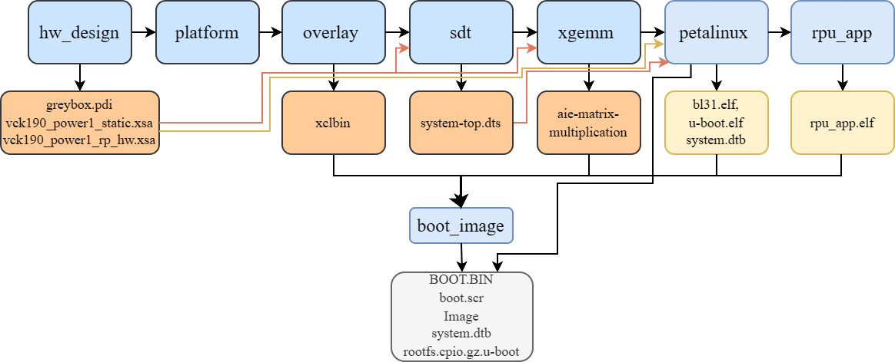
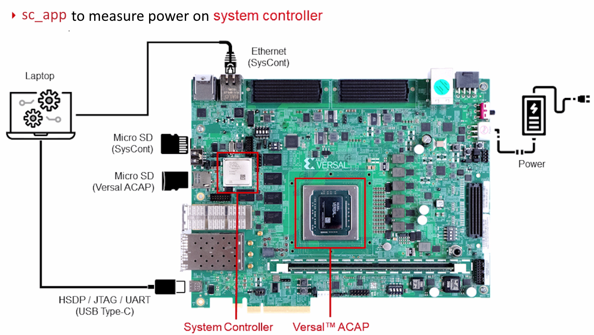

##### Copyright (C) 2023 - 2025, Advanced Micro Devices, Inc.  All rights reserved.
##### SPDX-License-Identifier: MIT
# Versal Power Demo
[](./LICENSE)
[](#1-introduction)
[](#2-build-instructions)
[](#3-directory-structure)
[](#4-test)
[](#5-measured-power)
[](#6-glossary)
[](#7-references)
[](#8-docker)


### 1. Introduction
This repository contains the source code needed to recreate, modify, and extend 
DFx configured power demo to demonstrate Versal and ZynqMP devices various power
 modes. It demonstrates the below power modes on vck190 and zcu102 boards.
```
 1. APU, RPU, PL and AIE load (typical max power mode)
 2. APU, RPU, PL and AIE in half freq. @625MHz load
 3. APU, RPU, PL load and AIE clock gated
 4. APU and RPU full load, PL in low power (PS max power mode)
 5. APU full load, RPU idle, PL in low power
 6. APU (APU0 only) full load, RPU idle, PL in low power
 7. APU (APU0 low freq 300MHz) full, RPU idle, PL in low power
 8. APU Linux Idle, RPU idle, PL in low power (Linux Idle)
 9. APU suspended with FPD ON, RPU idle, PL in low power
10. APU suspended with FPD OFF, RPU full load, PL in low power
11. APU suspended with FPD OFF, RPU idle, PL in low power
12. APU suspended with FPD OFF, RPU suspended, PL in low power
```

To build sample designs from source code in this repository, you will need to have the
following tools installed and follow the [build instructions](#2-build-instructions):

- A Linux-based host OS with Vivado, Vitis and PetaLinux tools installed. It requires
  about 125GB free disk space
- AMD VCK190 or ZCU102 board
- [Vivado][1] 2024.2
- [Vitis][2] 2024.2
- [PetaLinux][3] 2024.2

[1]: https://www.xilinx.com/support/download/index.html/content/xilinx/en/downloadNav/vivado-design-tools.html
[2]: https://www.xilinx.com/support/download/index.html/content/xilinx/en/downloadNav/vitis.html
[3]: https://www.xilinx.com/support/download/index.html/content/xilinx/en/downloadNav/embedded-design-tools.html

<b>VCK190 Board:</b>


<b>Versal Power Domains:</b>


<b>ZCU102 Board:</b>


### 2. Build Instructions
```
Defaults:
 RELEASE=2024.2
 BOARD=vck190
 PETALINUX_BSP=/proj/petalinux/2024.2/petalinux-v2024.2_daily_latest/bsp/release/xilinx-vck190-v2024.2-final.bsp
 PETALINUX_SETTINGS=/proj/petalinux/2024.2/petalinux-v2024.2_daily_latest/tool/petalinux-v2024.2-final/settings.sh
 VITIS_SETTINGS=/proj/xbuilds/2024.2_daily_latest/installs/lin64/Vitis/2024.2/settings64.sh
 Note: Change Makefile variable RELEASE=202x.x to build for a different release version.
```
```bash
export PETALINUX_BSP=<PetaLinux BSP path>
export PETALINUX_SETTINGS=<PetaLinux install path>/settings.sh
export VITIS_SETTINGS=<Vitis_install_path>/Vitis/202x.x/settings64.sh
./settings.sh	# Verify environment variable settings in a shell session
```

Use make to build hardware design, platform, overlay, sdt, xgemm, petalinux, rpu_app and boot image
for `BOARD=[vck190|zcu102]`.
The final artifacts will be in the build.<BOARD>/images folder. Delete build artifacts folders build or build\hwflow_xxx, build\rpu_app, build\xilinx-xxx for a clean build.<br>
`Note:` It will take several hours (> 9 hours) to build all components.
- `make help`
- `make`
    or
- `make BOARD=[vck190|zcu102]`
    or
- `make hw_design`
- `make platform`
- `make overlay`
- `make sdt`
- `make xgemm`
- `make petalinux BOARD=[vck190|zcu102]`
- `make rpu_app BOARD=[vck190|zcu102]`
- `make boot_image BOARD=[vck190|zcu102]`



### 3. Directory Structure
```
.pm_demo
├── apu_app - APU
│   └── xgemm - AIE application
│       ├── designs
│       │   └── xgemm-gmio
│       │       ├── aie
│       │       │   └── kernels
│       │       ├── hw
│       │       ├── ps
│       │       │   └── linux
│       │       └── sw
│       └── platforms
├── boards
│   ├── vck190
│   └── zcu102
├─ build.<BOARD> - Build artifacts
│   ├─ ...
│   └─ images - Contains all build images
├── hw        - Hardware design
│   ├── ip
│   │   ├── bufg_ctrl
│   │   │   ├── src
│   │   │   └── xgui
│   │   └── power
│   │       ├── src
│   │       │   ├── vio_bram
│   │       │   └── vio_top_logic
│   │       └── xgui
│   ├── overlay
│   │   └── matrix_mul_thermal
│   │       └── aie
│   │           └── kernels
│   ├── platform
│   └── xdc
│       └── qor_scripts
└── rpu_app - RPU application
├── Dockerfile
├── LICENSE
├── Makefile
├── README.md
├── settings.sh  - Verify petalinux, vitis paths
└── xmake        - Docker make file (petalinux only for now)
```
### 4. Test

<b>SD mode:</b>
    Copy `BOOT.BIN, system.dtb, Image and rootfs.cpio.gz.u-boot` files to a bootable FAT32 formatted SD Card. Switch SD boot mode and power up the board. Use a terminal application to open console <T1: com0> and <T2: com2> (115200 8N1) connected to the board.
-   Once petalinux is up (T1), run the demo<br>    root@xilinx-vck190-2022301:~# `power_demo.sh`
-   Check the power rail values from the System controller on <T2> console<br>    T2: `sc_app -c listpower` <br> T2: `sc_app -c getpower -t VCCINT_PSFP`
-   System Controller BEAM web interface can also be used to measure power 

## 5. Versal Measured Power<br>
<span style="color:Orange">Note: The mmeasured power are typical values with default versal fan settings. The values vary depending on the ambient conditions.</span><br>

---
 <font size="1"> 

| Power State | Description | PLD<br>Power<br>(W)|FPD<br>Power<br>(W)|LPD<br>Power<br>(W)|SoC<br>Power<br>(W)|PMC<br>Power<br>(W)|BBRAM<br>Power<br>(W)|Total<br>Power<br>(W)|
| :---------- | :---------- | :----------: | :----------: | :----------: | :----------: | :----------: | :-------------: | :------------: |
|APU, RPU, PL, AIE full load (Max typical power)			|FPD, LPD, PLD and AIE in high power mode|35.1689|0.6897|0.1852|4.7791|0.1117|0.1070|41.0416|
|APU, RPU, PL, AIE Half Freq @625MHz               			|FPD, LPD, PLD and AIE in half freq 	 |28.1351|0.6653|0.1867|4.8478|0.1086|0.1070|34.0505|
|APU, RPU, PL in full and AIE clock gated	                |FPD, LPD, PLD and AIE clock gated   	 |21.9805|0.6531|0.1875|4.8615|0.1109|0.1070|27.9005|
|APU and RPU full load, PL in low power						|R5s Active, A72s Active				 | 2.6377|0.6516|0.1859|4.5182|0.1141|0.1070| 8.2145|
|APU full load, RPU idle, PL in low power					|R5s Idle, A72s Active					 | 2.6377|0.6485|0.1742|4.5045|0.1133|0.1070| 8.1852|
|APU (APU0 only) full load, RPU idle, PL in low power		|R5s Idle, 1 A72 Active					 | 2.6377|0.5097|0.1742|4.4770|0.1148|0.1078| 8.0212|
|APU (APU0 low freq 300MHz) full, RPU idle, PL in low power	|R5s Idle, APU0 300MHz					 | 2.6377|0.1999|0.1742|4.4633|0.1125|0.1070| 7.6946|
|APU Linux Idle, RPU idle, PL in low power					|R5s Idle, 1 A72 Idle					 | 2.6377|0.2487|0.1742|4.4633|0.1156|0.1070| 7.7465|
|APU suspended with FPD ON, RPU idle, PL in low power		|R5s Idle, A72s Off, DDR Self Refresh	 | 2.6377|0.4410|0.1625|4.4950|0.1109|0.1070| 7.9541|
|APU suspended with FPD OFF, RPU full load, PL in low power	|R5s Active, FPD Off					 | 2.6377|0.0000|0.1859|4.4221|0.1086|0.0867| 7.4410|
|APU suspended with FPD OFF, RPU idle, PL in low power		|R5s Idle, FPD Off, DDR Self Refresh	 | 2.6377|0.0000|0.1609|4.4083|0.1125|0.0867| 7.4061|
|APU suspended with FPD OFF, RPU suspended, PL in low power	|R5s suspended, FPD Off, DDR Self Refresh| 2.6377|0.0000|0.1617|4.4083|0.1156|0.0867| 7.4108|

Latency:
| Power State Transition						   | Latency (ms)|Notes	|
| :----------------------------------------------- | :----------:|:---	|
|PL high power → PL low power								| 284|		|
|APU1 ON → APU1 OFF											|  47|		|
|APU0 high freq → APU0 low freq								|   0|		|
|Linux full load → Linux Idle								|  57|		|
|Linux Idle (APU0 low freq) → Linux Suspended with FPD ON	| 132|		|
|Linux Suspended with FPD ON → Linux Suspended with FPD OFF	|6.85|		|
|Linux Suspended with FPD OFF → Linux Suspended with FPD ON	|   0|		|
|Linux Suspended with FPD ON → APU0 WakeUp					| 430|		|
|APU0 WakeUp → Linux resume (APU0 low freq)					| 273|		|
|APU0 low freq → APU0 high freq								|  ~0|		|
|APU1 OFF → APU1 ON											| 123|		|
|Linux Idle → Linux full load								|  NA|		|
|PL low power → PL high power								| 542|		|


</font>

## 6. Glossary
| Name| Description					|
| :---| :-------------------------- |
| AIE | Adaptable Intelligent Engine|
| APU | Application Processing Unit |
| FPD | Full Power Domain 			|
| LPD | Low Power Domain 			|
| RPU | Realtime Processing Unit	|
| PL  | Programmable Logic			|
| PLD | Programmable Logic Domain	|

## 7. References
[versal-acap-trm]:	https://docs.xilinx.com/r/en-US/am011-versal-acap-trm/Introduction
[zynqmp-trm]:		https://docs.xilinx.com/r/en-US/ug1085-zynq-ultrascale-trm/Zynq-UltraScale-Device-Technical-Reference-Manual
[vck190-eval-bd]:	https://docs.xilinx.com/r/en-US/ug1366-vck190-eval-bd
[zcu102-eval-bd]:	https://docs.xilinx.com/v/u/en-US/ug1182-zcu102-eval-bd
1. [Versal ACAP Technical Reference Manual][versal-acap-trm]<br>
2. [Zynq UltraScale+ Device Technical Reference Manual][zynqmp-trm]
3. [VCK190 Evaluation Board User Guide][vck190-eval-bd]
4. [ZCU102 Board User Guide][zcu102-eval-bd]
8. <b>Docker<b>
    ##### Install and setup docker
    - curl -fsSL https://get.docker.com -o get-docker.sh
    - `sh get-docker.sh`
    - `sudo groupadd docker`
    - `sudo usermod -aG docker ${USER}`  
      <b>`Note:`</b> This might require logout and log back in 
    - `sudo systemctl start docker`
    - `sudo chmod 777 /var/run/docker.sock`<br>
      <b>`Note:`</b> This may be needed if there is a permission denied error

    ##### Helpful docker commands
    - Restart docker:&emsp;&emsp;&emsp;&emsp;`sudo systemctl restart docker`
    - List images:&ensp;&emsp;&emsp;&emsp;&emsp;&emsp;`docker images ls`
    - Stop docker containers:&nbsp;`docker stop $(docker ps -a -q)`
    - Delete all images: &emsp;&emsp;&emsp;`docker system prune -a`
